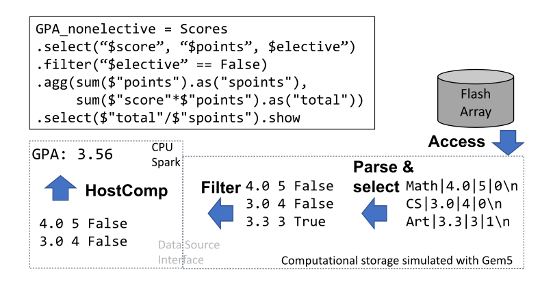

# Computational storage for Spark TPC-H

## Overview

This repo contains TPC-H implementation with Spark dataframes and offloading
to computational SSDs modeled with Gem5.

* All 22 TPC-H queries adapted from https://github.com/ssavvides/tpch-spark
* Computational SSD as a [Spark Datasource](https://spark.apache.org/docs/latest/sql-data-sources.html) that supports offloading parsing, column select and filtering operations.
* Computational SSD is modeled with Gem5 for architecture exploration.

## Prerequisite
* [gem5](https://github.com/compstorassasin/gem5) at `$HOME/gem5` with compiled `$HOME/gem5/build/RISCV/gem5.opt`
* [spark-3.1.2-bin-hadoop3.2](https://spark.apache.org/downloads.html) at repo root directory `$COMPSTOR`.
* TPC-H datasets with SF=10 at `$COMPSTOR/tpch/tbl_s1e1_data`
* (optional) MQSim(https://github.com/compstorassasin/MQSim) for retiming gem5-generated page traces.

## Usage
* `. setup_env.sh`
* `sbt package` at root directory first to compile Spark implementation of TPC-H.
* `cd $COMPSTOR/src/main/c && make release`
* `python3 $COMPSTOR/src/main/python3/tpch_partitioner.py`
* `python3 $COMPSTOR/src/main/python3/tpch_simlink.py --src_dir $COMPSTOR/tpch/tbl_s1e1_data --dest_dir $COMPSTOR/tpch/tbl_s1e1`
* `python3 $COMPSTOR/src/main/python3/run_tpch.py -r`

